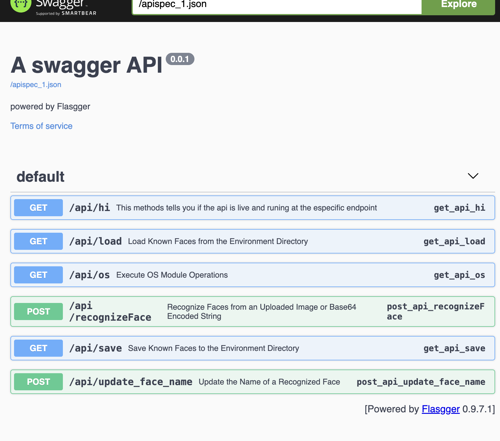
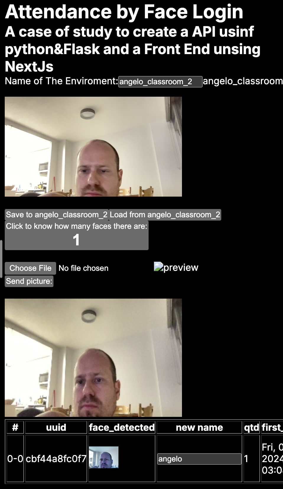

# #Over view of the API

When you have the api running to access the documentation the address will be /apidocs, eg: http://127.0.0.1:5001/apidocs

# Instalation


All the requirementes os the modules are listed on the file requirements.txt

```
pip install -r requirements.txt
```

# Docker

you can use the docker container to run.

Was build 4 diferentes dockerfiles, which gives you tow ways to build you docker image:

## First mode: build the images in peaces

### Dockerfile_1th_layer

This dockerfile content will build a image based on ubuntu, and will perfome many apt-get install on top of ubuntu

```
sudo docker build  -t "face_login_api_1th:Dockerfile" .
```

### Dockerfile_2nd_layer

This dockerfile content will build a image based onface_login_api_1th, and will perfome many pip installs on top offace_login_api_1th

```
sudo docker build  -t "face_login_api_2nd:Dockerfile" .
```

To run this image and have your api runngin you can perfome this comand:

```
docker run --rm  -p 5001:5000  face_login_api_3rd:Dockerfile
```


### Dockerfile_3rd_layer

This dockerfile content will build a image basedface_login_api_2nd, and will perfome many pip installs on top offace_login_api_1th

```
sudo docker build  -t "face_login_api_3rd:Dockerfile" .
```

To run this image and have your api runngin you can perfome this comand:

```
docker run --rm  -p 5001:5000  face_login_api_full:Dockerfile
```

## Second mode: build the image at once

```
sudo docker build --build-arg CACHEBUST=$(date +%s) -t "face_login_api_full:Dockerfile" .
```

# How to test the api??

Was build a UI to access with the API, in which the api end point and the enviroment is parametized.

As you can see on the following example:

```
https://face-login-ui.vercel.app/?api_url=http://127.0.0.1:5001&enviroment_name=angelo_classroom_2
```

Where **api_url** will represent what ever endpoint to the API you have and **enviroment_name** represents a class room, event, or what ever moment htat you want to identify a especific group of people.


